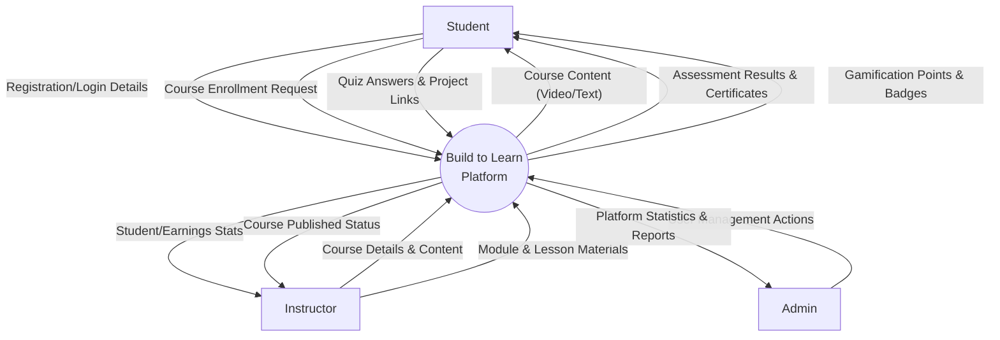
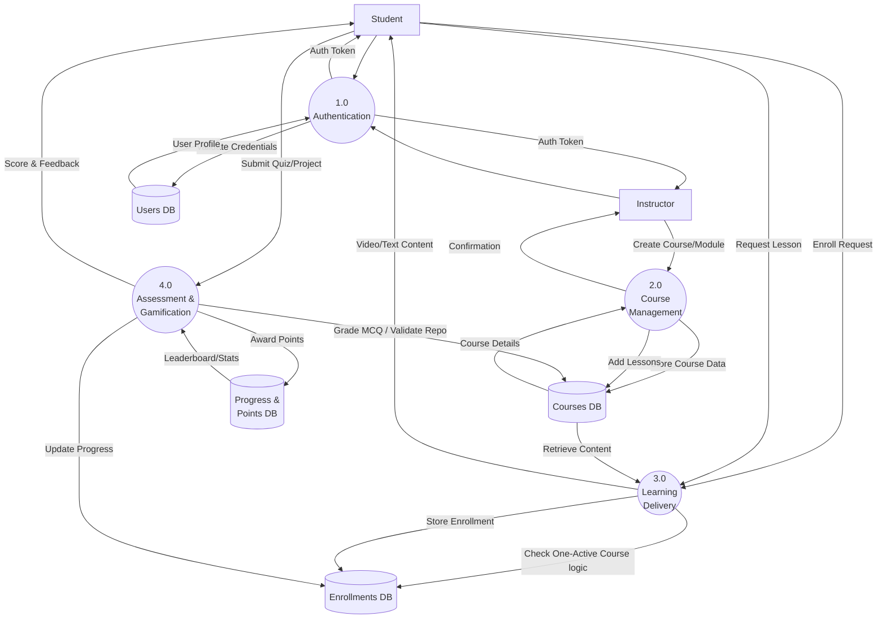
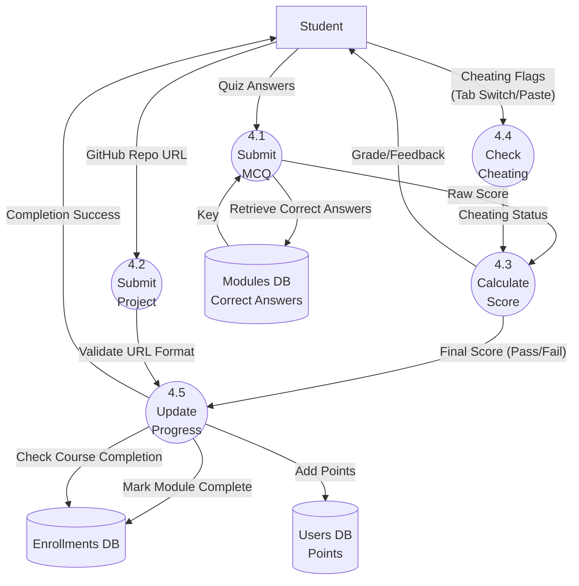

# Data Flow Diagrams - Build to Learn

## Level 0 DFD (Context Diagram)

This diagram shows the interaction between the **Build to Learn** system and external entities (Student, Instructor, Admin).

## Level 1 DFD (System Overview)

This diagram breaks down the system into its core functional processes.

## Level 2 DFD (Process 4.0: Assessment & Gamification)

This diagram details the **Assessment** process, showing how Quizzes and Projects are handled, including anti-cheat and gamification logic.

## Description of Processes

1.  **Authentication (1.0):** Handles user registration, login, and JWT token issuance.
2.  **Course Management (2.0):** Allows instructors to create courses, add modules, upload video URLs, and manage lesson content.
3.  **Learning Delivery (3.0):** Manages student enrollment (enforcing the single active course rule) and delivers course content structure.
4.  **Assessment & Gamification (4.0):**
    *   **4.1 Submit MCQ:** Validates answers against the database.
    *   **4.2 Submit Project:** Validates GitHub repository links.
    *   **4.4 Check Cheating:** Detects behavioral flags like tab switching.
    *   **4.5 Update Progress:** Updates the user's progress, unlocks the next module, and awards gamification points (10pts per module, bonus for completion).
