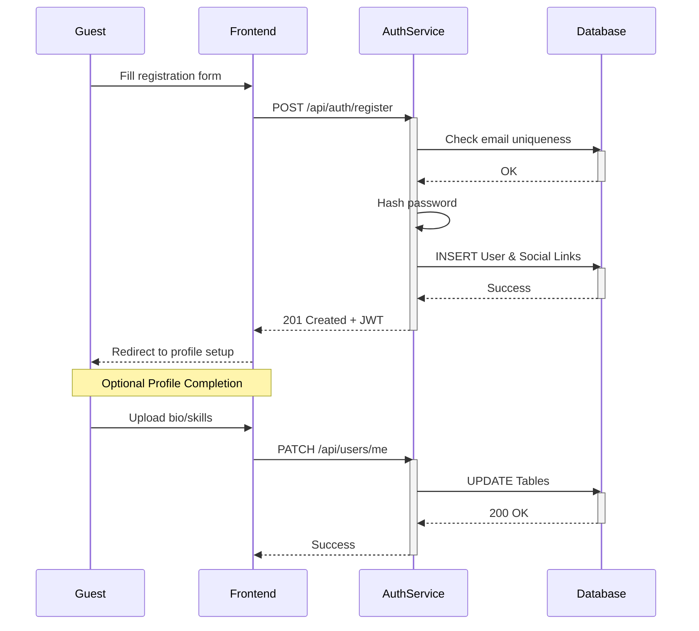
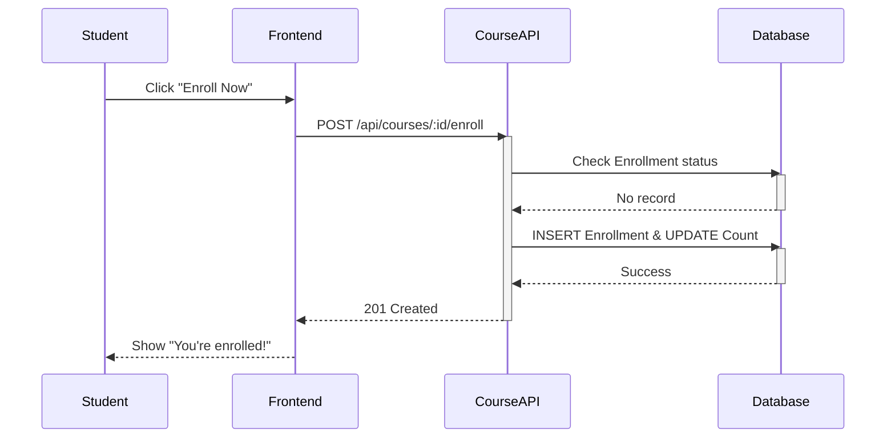
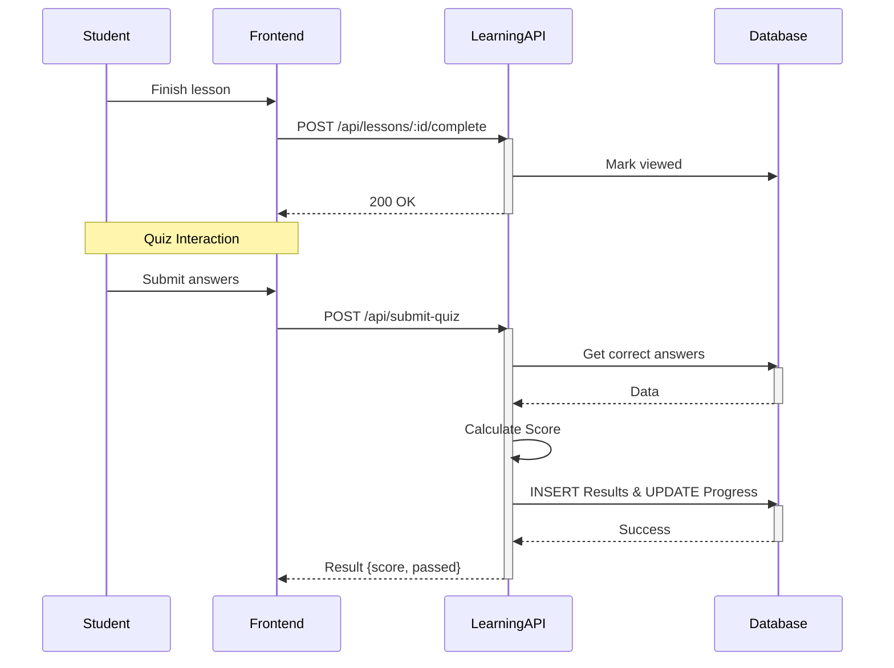
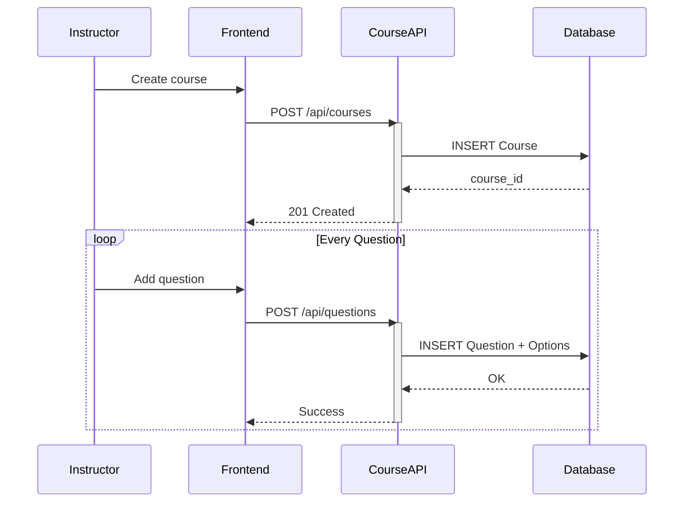
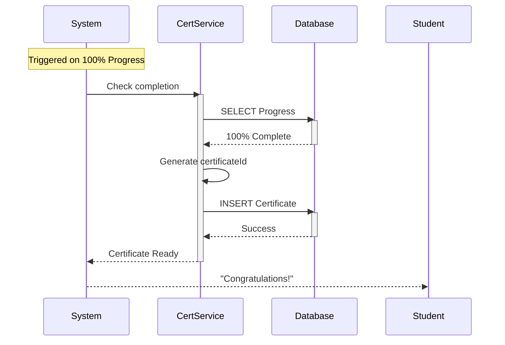
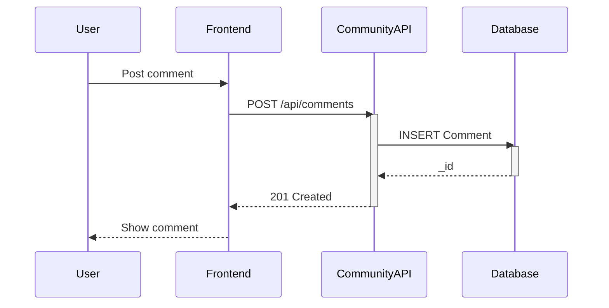

# Sequence Diagrams

## Here are the **most important sequence diagrams** for a modern online learning platform.

### 1. User Registration + Profile Completion

This version shows the `AuthService` staying active while it handles multiple database calls.

---

### 2. Student Enrolls in a Course

This clearly shows the "Timeline" of the `CourseAPI` during the validation and insertion phase.

---

### 3. Lesson + Quiz (The Core Flow)

This is the most complex timeline. It shows the API "holding" the process while it calculates scores.

---

### 4. Instructor Course Creation

This demonstrates a "loop" timeline where the instructor keeps the process active while adding multiple questions.

---

### 5. Certificate Issuance

Notice the `System` and `CertificateService` interacting to show an automated backend timeline.

---

### 6. Forum Interaction

A simple timeline showing the request-response cycle for community features.

